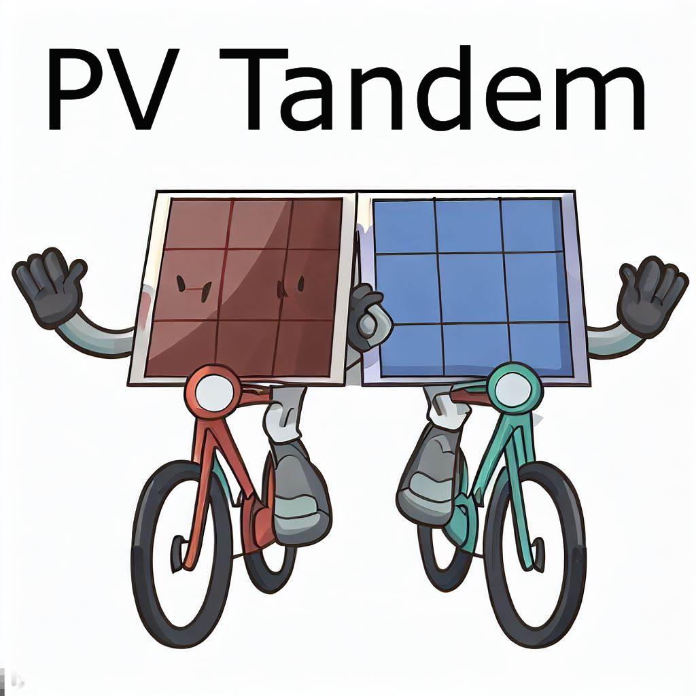

.. image:: https://img.shields.io/pypi/v/pv_tandem.svg
        :target: https://pypi.python.org/pypi/pv_tandem

.. image:: https://img.shields.io/github/actions/workflow/status/nano-sippe/pv_tandem/pytest.yml
        :target: https://github.com/nano-sippe/pv_tandem/actions/workflows/pytest.yml/badge.svg

.. image:: https://readthedocs.org/projects/pv-tandem/badge/?version=latest
        :target: https://pv-tandem.readthedocs.io/en/latest/?version=latest
        :alt: Documentation Status

PV Tandem is a python toolbox for simulation and energy yield calculations of single junction and tandem solar cells.

* Free software: MIT license
* Documentation: https://pv-tandem.readthedocs.io.

Features
--------

* TODO

Credits
-------

This package was created with Cookiecutter_ and the `audreyr/cookiecutter-pypackage`_ project template.

.. _Cookiecutter: https://github.com/audreyr/cookiecutter
.. _`audreyr/cookiecutter-pypackage`: https://github.com/audreyr/cookiecutter-pypackage
