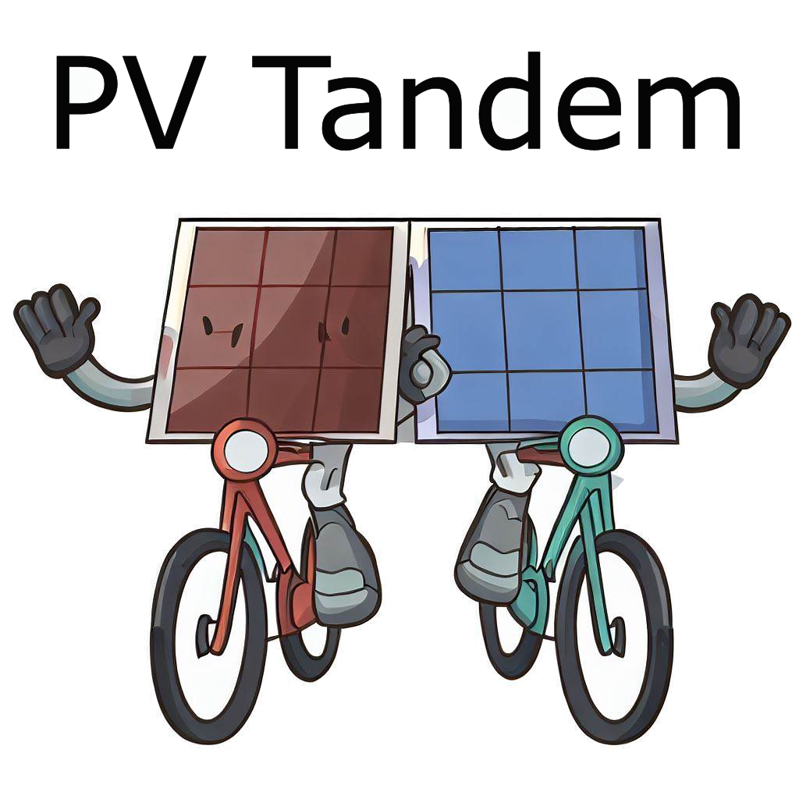

.. image:: https://img.shields.io/pypi/v/pv_tandem.svg
        :target: https://pypi.python.org/pypi/pv_tandem

.. image:: https://img.shields.io/github/actions/workflow/status/nano-sippe/pv_tandem/pytest.yml
        :target: https://github.com/nano-sippe/pv_tandem/actions/workflows/pytest.yml/badge.svg

.. image:: https://readthedocs.org/projects/pv-tandem/badge/?version=latest
        :target: https://pv-tandem.readthedocs.io/en/latest/?version=latest
        :alt: Documentation Status

pv_tandem is a python toolbox for simulation and energy yield calculations of single junction and tandem solar cells with classical (monofacial) or bifacial illumination.

* Free software: MIT license
* Documentation: https://pv-tandem.readthedocs.io.

Features
--------

* Helping tools to process irradiance data for solar cell simulations
* Electrical modeling with 1-diode model for single junction or tandem solar cells
* Modeling of illumination in a large PV power plant for the front- and backside of the modules

Where to get it
---------------

pv_tandem can easily be installed with pip:

.. code-block:: bash

    pip install pv_tandem

For more installation options see the `getting started <https://pv-tandem.readthedocs.io/en/latest/usage.html>`_ section of the documentation. See the `example gallery <https://pv-tandem.readthedocs.io/en/latest/auto_examples/index.html>`_ to see use cases of pv_tandem.
