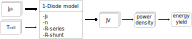
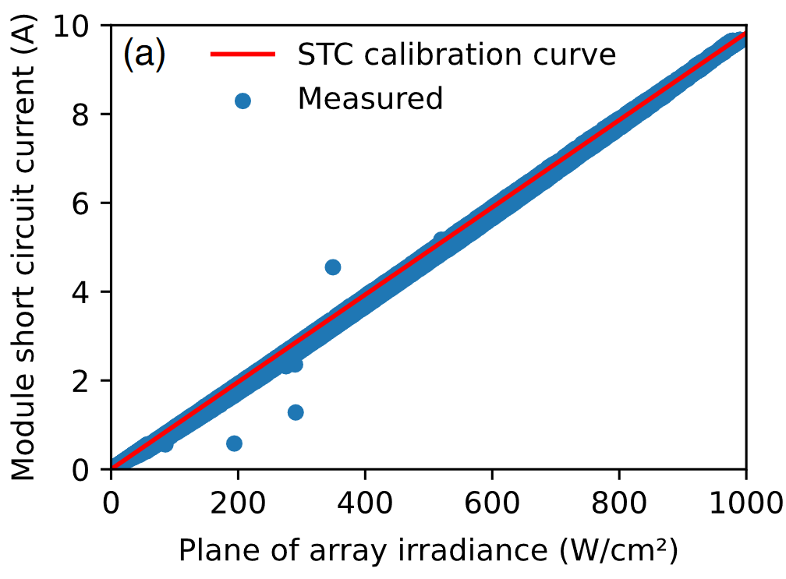
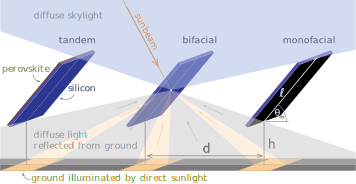

.. _model_basics:

Model basics
============

pv_tandem is a collection of modelling functions to enable the performance evaluation of single junction and tandem solar cells. The outdoor performance simulation of a solar cell typically requires a combination of several models, chained together. The core data flow of pv_tandem is shown in the follwoing figure.

.. _model_chain:

    
    Basic modelchain of pv_tandem

Figure :numref:`model_chain` shows the basic dataflow of a simulation with pv_tandem. The basic requirments for a solar cell simulation are the photocurrent desity, cell temperature and the solar cell characteristics. Based on these inputs pv_tandem uses one (single junction cell) or two (tandem cell) 1-diode models to calculate the JV (Current density vs Voltage) curve, which can be used to calculate the characteristic points, such as maximum power point (MPP) or open circuit voltage (V\ :sub:`OC`)

For an energy yield calculation a time series of photocurrent density and cell temperaure is required, that should representation an average of the expected conditions (e.g. typically metrological year (TMY) datasets). For each timestemp the full JV-curve is calculated and the maximum power is evaluated. For the energy yield, the MPP is integrated over time for the total electricity production in the simulated timeframe.

Calculating photocurrent density
________________________________

The photocurrent density of a solar cell depends on two quantities, the spectral irradiance on the solar cell on the one hand and the spectral response of the solar cell on the other hand (often refered to as external quantum efficiency (EQE)). From the spectral irradiance and the EQE the photocurrent density can be calculated according to:

.. math::

    J_\text{ph} = e\int_{\text{300 nm}}^{\text{1200 nm}} EQE(\lambda)E(\lambda)\frac{\lambda}{hc} \mathrm{d}\lambda

with e as elementary charge and E as spectral irradiance.

One of the most accessable data sources for spectral irradiance is the `National Solar Radiation Database (NSRDB) <https://nsrdb.nrel.gov/>`_ provided by National Renewable Energy Laboratory (NREL), a US govermental organization. With their dataproduct `"spectral on-demand" <https://nsrdb.nrel.gov/data-sets/spectral-on-demand-data>`_ year-wise data can be downloaded on a plane defined by a tilt angle. The disadvantage of the dataset is the missing components of direct and diffuse spectral irradiance, which makes it hard to combine with pv_tandem's bifacial illumination model.

For examples of how to use pv_tandem to calculate the photocurrent density, see the gallery :ref:`sphx_glr_auto_examples_basics_plot_jph_from_spec.py`.

While spectral effects can have a significant impact on the performance of tandem solar cells (due to current matching constrains), silicon single junction cells are less effected. Additionaly, non-spectral irradiance data and short circuit current ratings for standart test conditions are much more available then EQE and spectral irradiance data.

.. _irrad_jsc:

    
    Short circuit current as a function of the irradiance on the module measured in Jerusalem, Isreal. Taken from placholder published under `CC BY 4 <https://creativecommons.org/licenses/by/4.0/>`_

As shown in fig. :numref:`irrad_jsc` it can therefore be sensible to calculate the photocurrent (density) from the irradiance and STC rating as follows:

.. math::
    
    J_\text{ph} = \frac{E}{1000 W/m²} \cdot J_\text{STC}

with E as the irradiance on the module. This method ist used in the examples :ref:`sphx_glr_auto_examples_energy_yield_plot_silicon_ey.py`

Cell temperature
________________

pv_tandem does not integrate a model for the cell temperatue, however using the Ross temperatue model from pvlib is easily possible. The Ross model is also known as NOCT (Nominal Operating Cell Temperature) and is a standard methodology used to estimate the operating temperature of photovoltaic (PV) cells/modules under real-world conditions. NOCT is defined as the operating temperature of the PV cell when subjected to a specific set of conditions:

* An incident solar irradiance of 800 W/m² on the cell surface
* An ambient temperature of 20°C
* A wind speed of 1 m/s
* The module is mounted in an open rack

The NOCT is an essential parameter as the efficiency of the PV cells/modules is temperature-dependent. The power output of PV modules decreases as their operating temperature increases.

The NOCT model is used to simulate the module/cell temperature under varying irradiance and ambient temperature conditions. The basic formula for the model is:

.. math::

    T_{cell} = T_{a} + (NOCT - 20°C) * \frac{G}{800 W/m²}

With :math:`T_{cell}` as the cell temperature (°C), :math:`T_{a}` as the ambient temperature (°C) and :math:`G` as the solar irradiance on the module surface (W/m²)

One-diode model
_______________

pv_tandem uses a one-diode model to calculate the IV-characterisitc of single junction and tandem solar cells for each time instance based on the photocurrent density and the cell temperaure. The diode equation is given by:

The formular of the 1-diode model ist given by:

.. math::

	J(V) = J_\text{ph}-J_\text{0}\left[\exp\left(\frac{V+J\cdot R_\text{series}}{kT/e}\right)-1\right]-\frac{V+J \cdot R_\text{series}}{R_\text{shunt}}

with :math:`J` as cell current density, :math:`V` as cell voltage, :math:`J_\text{ph}` as phototcurrent desity, J\ :sub:`0` as dark saturation current, R\ :sub:`series` as series resistance and R :sub:`shunt` as shunt resistance.

Bifacial illumination
_____________________

The bifacial illumiantion model used in pv_tandem is based on view factors and is described in detail in ...
The model assumse that the simulated module is in a large PV field with infinitly many rows and infinitly wide rows and therefore no edge effects are considers.

.. _irrad_jsc2:

    
    Short circuit current as a function of the irradiance on the module measured in Jerusalem

As shown in fig. :numref:`irrad_jsc2` it can therefore be sensible to calculate the photocurrent (density) from the irradiance and STC rating as follows:

.. _bif_sketch:

    
    Sketch of the model parameters used by the bifaical illumiantion model, taken from placeholder published under CC BY 4 (https://creativecommons.org/licenses/by/4.0)

Sketch of the model parameters used by the bifaical illumiantion model, taken from ... published under `CC BY 4 <https://creativecommons.org/licenses/by/4.0/>`_

Figure :numref:`bif_sketch` shows a sketch of the model parameters ...

Bandgap-shifting of perovskite material
_______________________________________

